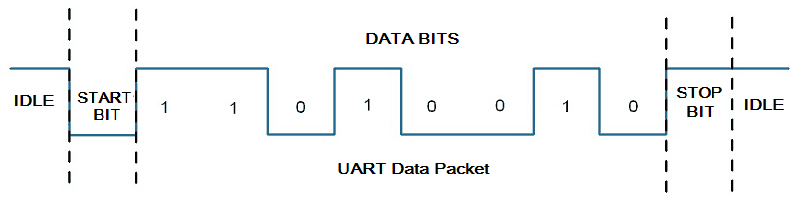
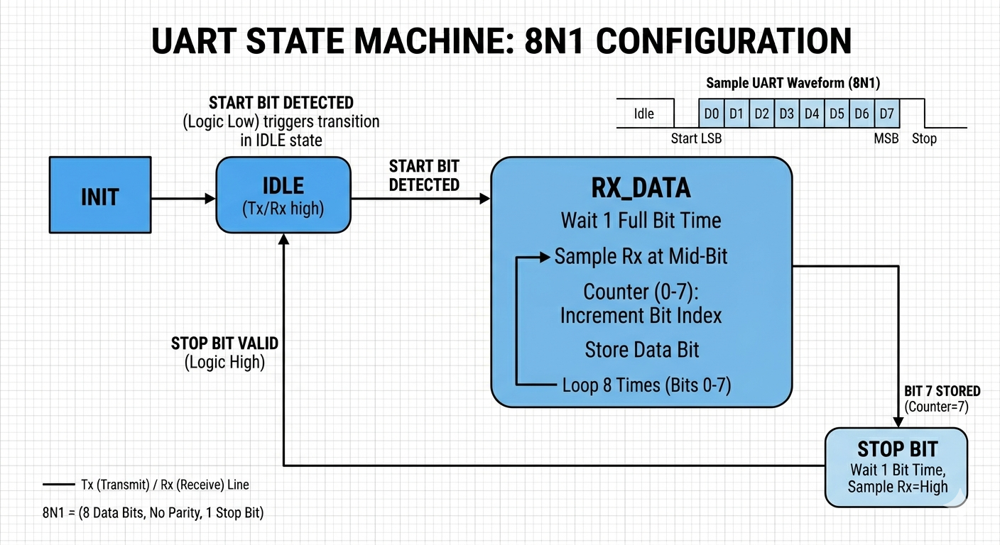
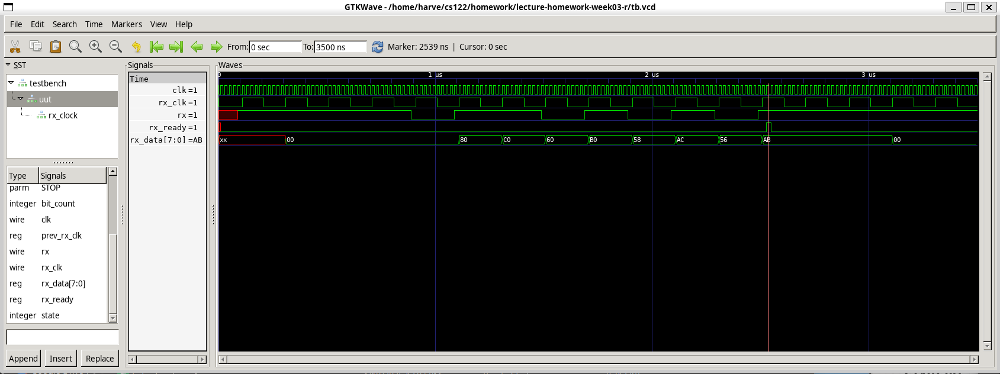

# Lecture Homework Week 03 - Thursday

For this lecture homework, you will **create** a module to receive a UART byte in 8N1 format.
A typical data frame for this protocol looks like the following:



In this assignment, you will configure both the source clock frequency and the UART baud rate. The default values provided in the code are 78600 and 9600, respectively.

A new concept you will need to be familiar with is **Clock Domain Crossing (CDC)**. You must be careful when reading or writing data across two dissimilar clocks. This [article on Nandland](https://nandland.com/lesson-14-crossing-clock-domains/) describes the issue and discusses a solution. Similarly, this [ChipVerify article](https://www.chipverify.com/rtl-synthesis/clock-domain-crossing) discusses the same subject. I recommend reading both to understand this concept. We will also cover it in the lecture.

## Getting the Code

As with the previous lecture homework, this assignment is hosted on GitHub. You will create your own repository using the assignment repository as a template. To do this:

1.  Click on **"Use this template."**
2.  Select **"Create a new repository."**
3.  Give your repository a descriptive name.
4.  Click **"Create repository."**

Once created, clone the repository to your local machine or open it in a GitHub Codespace to begin working.

## Writing the UART Receiver

The UART receiver, called `uart_rx`, has two inputs and two outputs. Additionally, this module is configured using two parameters: `SRC_FREQ` and `BAUDRATE`. These parameters are used in a clock multiplier to output a clock for the UART receiver at the correct baud rate. Fortunately, I have provided a module to handle this, so you do not have to write your own clock multiplier.

Below is a table with all the module parameters, inputs, and outputs. The inputs and outputs should match the order of the table in your Verilog code. All names, including case sensitivity, should match exactly.

| Name | Type | Size | Description |
| :--- | :--- | :--- | :--- |
| **SRC\_FREQ** | parameter | N/A | The frequency of the source clock. |
| **BAUDRATE** | parameter | N/A | The configured baud rate of the UART protocol. |
| **clk** | input | 1-bit | The system source clock signal (synchronous). |
| **rx** | input | 1-bit | The Rx signal received from the Tx of the other device. |
| **rx\_ready** | output | 1-bit | A signal indicating the completion of receiving one byte. |
| **rx\_data** | output | 8-bits | The byte received via the UART protocol. |

### Functional Requirements

  * **Ready Indicator:** The ready indicator should be set high (1) for exactly one **source clock** cycle. This requirement is where you will encounter clock domain crossing.
  * **Output:** The output is the value read from the `rx` signal, which arrives **least significant bit (LSB) first**.
  * **State Machine:** Your implementation should include a state machine. The states are provided in the code, and an example state machine is fully described in the Implementation Details section below.
  * **File Name:** Write your Verilog code in `uart_rx.sv`. Some of the implementation is already provided.

### Implementation Details

You will need to create a state machine to properly implement this module. Below is an image of a state machine that will work for this module. You are free to use a different state machine as long as it correctly reads a byte from the `rx` port.



In the provided `uart_rx.sv` file, each state is defined as a `localparam`. You may use these or define your own. You can find these predefined states in `uart_rx.sv` under the comment block labeled `STATES`.

You will also need to instantiate the clock multiplier. The code suggests a place for this instantiation under the comment `CLOCK MULTIPLIER`. Review the implementation file `clock_mul.sv` to find the parameters and ports for this module.

There is also a comment labeled `CROSS CLOCK DOMAIN`, which suggests a place to set the `rx_ready` flag to high for exactly one source clock period. This concept will be discussed in lecture.

Finally, the comment labeled `STATE MACHINE` is a good place to put your state machine logic. It should use an `always` block triggered on the positive edge of the **UART clock**.

An implementation that passes testing should produce a waveform similar to the following:



## Synthesizing

Before running the simulation, you must compile (synthesize) the code using `iverilog`. Run the following command in your terminal:

```bash
iverilog -o testbench -g2009 testbench.sv uart_rx.sv clock_mul.sv
```

> **Note:** Ensure you include all necessary source files in your compilation command.

This command generates a simulation executable named `testbench`.

You can test different byte values by changing the parameter called `TX_DATA_VALUE` within the code, or by overriding the parameter during synthesis using the following command:

```bash
iverilog -o testbench -g2009 testbench.sv uart_rx.sv clock_mul.sv -Ptestbench.TX_DATA_VALUE=123
```

Be sure to set `TX_DATA_VALUE` to a value that fits into 8 bits (0-255), or your tests may fail.

## Running the Testbench

Run the simulation and observe the results. If your design is correct, you should see:

```text
VCD info: dumpfile tb.vcd opened for output.
Tests Passed!
```

If the design is incorrect, the output will show:

```text
VCD info: dumpfile tb.vcd opened for output.
Failed tests
```

If your tests are failing and you cannot identify the error, use **GTKWave** to inspect the waveforms stored in `tb.vcd`.

## What to Turn In

1.  Submit your work by **committing and pushing** your changes to your GitHub repository.
2.  Upload the assignment via **Gradescope**.
3.  When prompted, log in to GitHub, select your homework repository, and submit.
